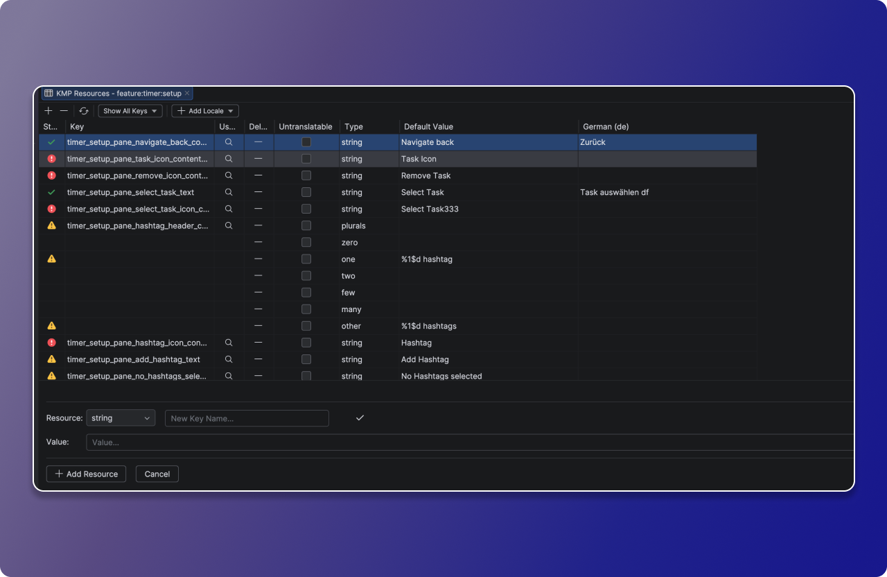
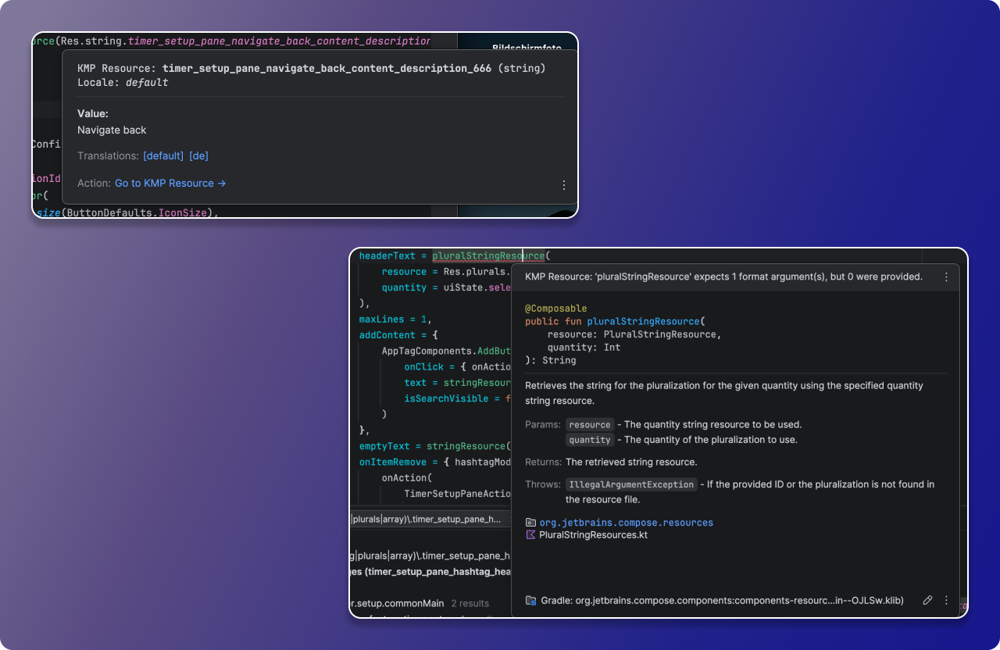
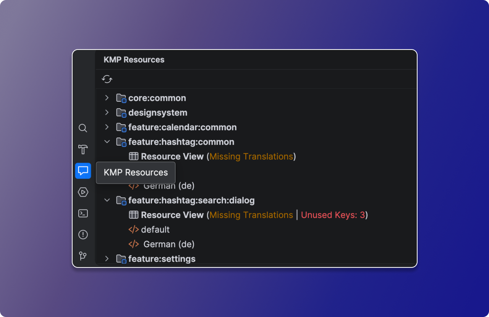

#  KMP Resources

 

**KMP Resources** is an advanced Table Editor and Refactoring Tool tailored for Compose Multiplatform (and Android Native) projects in IntelliJ IDEA and Android Studio.

## ✨ Features

* **Visual Table Editor:** View, filter, and edit all your strings, plurals, and string-arrays in a clean, centralized UI. Edit keys and values across all languages simultaneously.
* **Smart Locale Management:** Easily add, edit, or remove translation locales via a searchable popup. The plugin automatically generates and manages the required `values-***` directories with strict BCP 47 validation.
* **Safe Key Renaming:** Rename a resource key in the editor and instantly refactor all Kotlin usages (`Res.string.*`) across your module, handling necessary imports automatically.
* **Format Argument Linter:** Real-time IDE inspections to prevent missing or mismatched format arguments (like `%1$s` or `%d`) in your Compose Multiplatform code.
* **Generate on the Fly:** Type a non-existent key in Kotlin, hit **Alt+Enter**, and instantly create the XML tag and trigger a Gradle resync without leaving the file.
* **Quick Documentation:** Hover over any KMP resource in your code to see its actual value, type, and navigate directly to available translations.

---

## 📸 Screenshots

### The Resources Table Editor

Manage all your multiplatform strings, plurals, and arrays in one place.

### Smart Inspections & Quick Documentation

Catch formatting errors in real-time before you compile, and hover over any key to view translations and switch locales seamlessly.

### Diagnostics Toolwindow

Keep your project clean with an overview of missing translations and unused keys across all modules.

---

## 💻 Installation

### Option 1: Using the IDE built-in plugin system (Recommended)

1. Open your IDE (<kbd>Settings/Preferences</kbd> > <kbd>Plugins</kbd> > <kbd>Marketplace</kbd>).
2. Search for **KMP Resources**.
3. Click <kbd>Install</kbd> and restart your IDE.

### Option 2: Manual Installation

1. Download the [latest release](https://plugins.jetbrains.com/plugin/31018-kmp-resources/versions) from the JetBrains Marketplace.
2. Navigate to <kbd>Settings/Preferences</kbd> > <kbd>Plugins</kbd> > <kbd>⚙️</kbd> > <kbd>Install plugin from disk...</kbd>.
3. Select the downloaded `.zip` file and restart.

## 🤝 Contributing

Contributions are welcome! Please feel free to submit a Pull Request or open an issue if you encounter any bugs. Make sure to read our [Code of Conduct](CODE_OF_CONDUCT.md) first.

## 📄 License

This project is licensed under the Apache 2.0 License - see the [LICENSE](LICENSE) file for details.