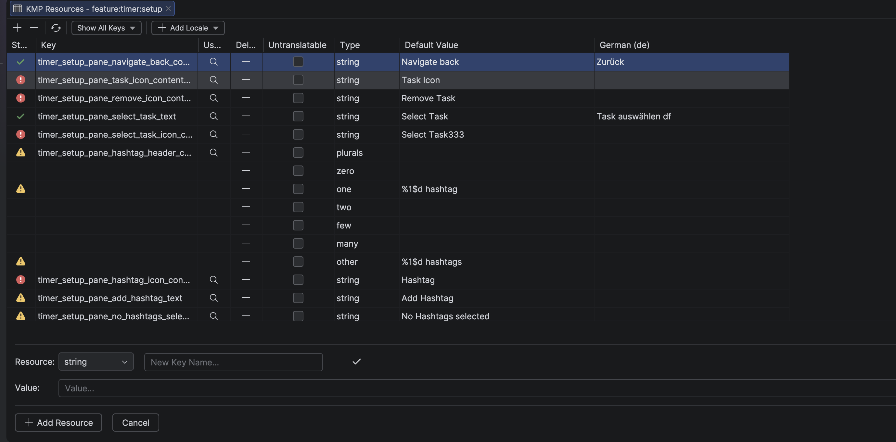
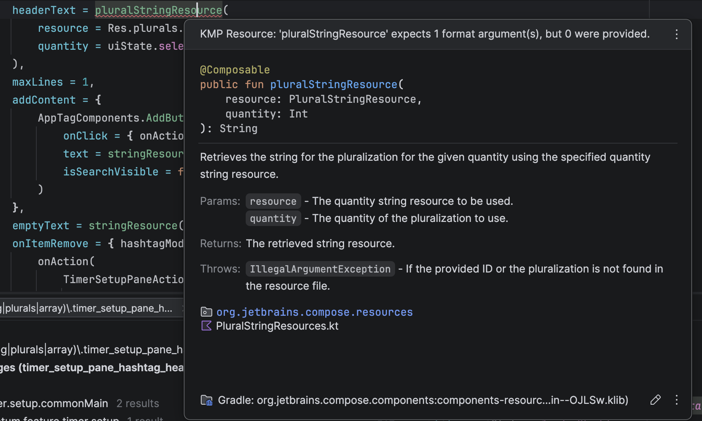
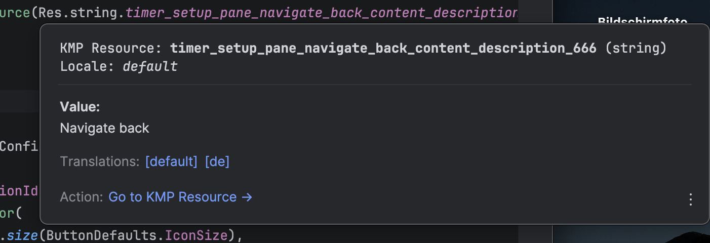
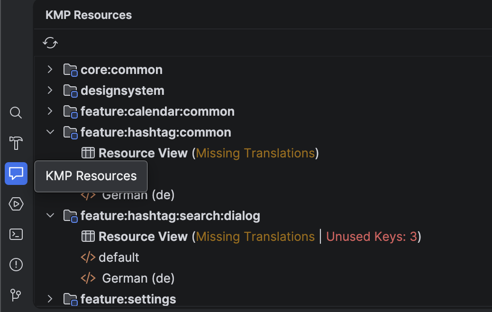

# KMP Resources

**KMP Resources** is an advanced Table Editor and Refactoring Tool tailored for Compose Multiplatform projects in
IntelliJ IDEA and Android Studio.

## ✨ Features

* **Table Editor:** View, filter, and edit all your strings, plurals, and string-arrays in a clean, centralized UI.
* **Safe Key Renaming:** Rename a resource key in the editor and instantly refactor all Kotlin usages (`Res.string.*`)
  across your module.
* **Format Argument Linter:** Real-time IDE inspections to prevent missing or mismatched format arguments (like `%1$s`
  or `%d`) in your Compose Multiplatform code.
* **Locale Management:** Easily add new translation locales via a searchable popup (including flag emojis and country
  names).
* **Quick Documentation:** Hover over any KMP resource in your code to see its actual value, type, and navigate directly
  to translations.

---

## 📸 Screenshots

### The Resources Table Editor

Manage all your multiplatform strings, plurals, and arrays in one place.

### Real-time Linter

Instantly catch missing or mismatched format arguments before you compile.

### Quick Documentation & Locale Switching

Hover over any key in your Kotlin code to see the actual translations and navigate between locales seamlessly.

### Diagnostics Toolwindow

Keep your project clean with an overview of missing translations and unused keys across all modules.

---

## 💻 Installation

### Option 1: Using the IDE built-in plugin system (Recommended)

1. Open your IDE (<kbd>Settings/Preferences</kbd> > <kbd>Plugins</kbd> > <kbd>Marketplace</kbd>).
2. Search for **KMP Resources**.
3. Click <kbd>Install</kbd> and restart your IDE.

### Option 2: Manual Installation

1. Download the [latest release](https://plugins.jetbrains.com/plugin/MARKETPLACE_ID/versions) from the JetBrains
   Marketplace.
2. Navigate to <kbd>Settings/Preferences</kbd> > <kbd>Plugins</kbd> > <kbd>⚙️</kbd> > <kbd>Install plugin from
   disk...</kbd>.
3. Select the downloaded `.zip` file and restart.

## 🤝 Contributing

Contributions are welcome! Please feel free to submit a Pull Request or open an issue if you encounter any bugs. Make
sure to read our [Code of Conduct](CODE_OF_CONDUCT.md) first.

## 📄 License

This project is licensed under the Apache 2.0 License - see the [LICENSE](LICENSE) file for details.